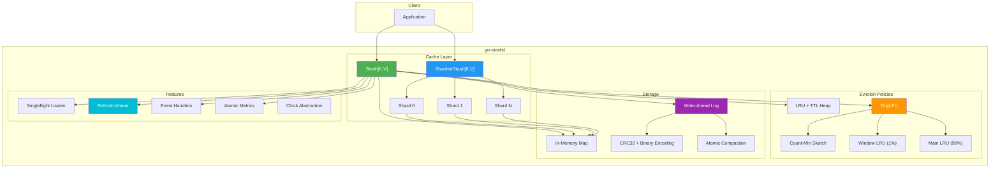

# go-stashd

A crash-consistent, in-memory TTL cache for Go with write-ahead logging.

[](https://pkg.go.dev/github.com/goelayush89/go-stashd)
[](https://goreportcard.com/report/github.com/goelayush89/go-stashd)

## Features

- **Crash Consistency** — Write-ahead logging (WAL) ensures data survives restarts
- **Generics** — Type-safe `Stash[K, V]` with any comparable key and value type
- **TTL Support** — Automatic expiration with efficient min-heap tracking
- **Refresh-Ahead** — Background refresh before expiration (stale-while-revalidate)
- **TinyLFU Eviction** — State-of-the-art eviction with superior hit rates
- **Sharded Cache** — Reduced lock contention for high-concurrency workloads
- **Thread-Safe** — Safe for concurrent access with fine-grained locking
- **Testable** — Clock abstraction enables deterministic testing

## Architecture



### Component Overview

| Component | Description |
|-----------|-------------|
| **Stash** | Single-lock cache with full feature support |
| **ShardedStash** | Multi-shard cache for high concurrency (5x faster) |
| **TinyLFU** | W-TinyLFU eviction with Count-Min Sketch frequency estimation |
| **WAL** | CRC32-protected binary log with atomic compaction |
| **Refresh-Ahead** | Background refresh before TTL expiry |
| **Loader** | Singleflight-protected data loading |

## Installation

```bash
go get github.com/goelayush89/go-stashd
```

## Quick Start

```go
package main

import (
    "fmt"
    "time"

    stashd "github.com/goelayush89/go-stashd"
)

func main() {
    // Create cache with 5-minute TTL
    cfg := stashd.Config{
        DefaultTTL:      5 * time.Minute,
        CleanupInterval: 1 * time.Minute,
    }

    cache, _ := stashd.Open[string, string](cfg)
    defer cache.Close()

    // Store values
    cache.Put("user:1", "Alice")
    cache.PutWithTTL("session:abc", "data", 30*time.Second)

    // Retrieve values
    if val, ok := cache.Fetch("user:1"); ok {
        fmt.Println("Found:", val)
    }

    // Remove values
    cache.Remove("user:1")
}
```

## Crash Consistency with WAL

Enable persistence to survive process restarts:

```go
cfg := stashd.Config{
    DefaultTTL:      5 * time.Minute,
    CleanupInterval: 1 * time.Minute,
    WALPath:         "./cache.wal",  // Enable persistence
    SyncWrites:      true,           // Sync to disk on each write
}

cache, _ := stashd.Open[string, string](cfg,
    stashd.WithKeyCodec[string, string](stashd.StringCodec{}),
    stashd.WithValueCodec[string, string](stashd.StringCodec{}),
)
defer cache.Close()

cache.Put("important", "data")
// Data survives even if process crashes!
```

### Custom Types with JSON Codec

```go
type User struct {
    Name  string
    Email string
}

cache, _ := stashd.Open[string, User](cfg,
    stashd.WithKeyCodec[string, User](stashd.StringCodec{}),
    stashd.WithValueCodec[string, User](stashd.JSONCodec[User]{}),
)

cache.Put("user:1", User{Name: "Alice", Email: "alice@example.com"})
```

## API Reference

| Method | Description |
|--------|-------------|
| `Open[K, V](cfg, opts...)` | Create a new Stash instance |
| `Put(key, value)` | Store with default TTL |
| `PutWithTTL(key, value, ttl)` | Store with custom TTL |
| `Fetch(key)` | Retrieve value (returns value, found) |
| `GetOrSet(key, value)` | Get if exists, else store and return |
| `GetOrSetFunc(key, fn)` | Get if exists, else compute and store |
| `GetOrLoad(key)` | Get if exists, else load via Loader |
| `Has(key)` | Check if key exists |
| `Touch(key)` | Reset TTL without re-storing |
| `Remove(key)` | Delete a key |
| `Keys()` | Get all unexpired keys |
| `Range(fn)` | Iterate over all entries |
| `Len()` | Number of entries |
| `Purge()` | Clear all entries |
| `DeleteExpired()` | Remove expired entries |
| `Metrics()` | Get cache metrics snapshot |
| `ResetMetrics()` | Clear all metrics counters |
| `Close()` | Shutdown and release resources |

## Metrics

Built-in observability with atomic counters:

```go
m := cache.Metrics()

fmt.Printf("Hit Rate: %.2f%%\n", m.HitRate*100)
fmt.Printf("Hits: %d, Misses: %d\n", m.Hits, m.Misses)
fmt.Printf("Puts: %d, Deletes: %d\n", m.Puts, m.Deletes)
fmt.Printf("Evictions: %d\n", m.Evictions)
fmt.Printf("WAL Writes: %d, Errors: %d\n", m.WALWrites, m.WALErrors)
```

## Error Handling

Sentinel errors for production use:

```go
import "errors"

err := cache.Put("key", "value")
if errors.Is(err, stashd.ErrClosed) {
    // Cache was closed
}

_, err = stashd.Open[string, string](stashd.Config{DefaultTTL: -1})
if errors.Is(err, stashd.ErrInvalidConfig) {
    // Invalid configuration
}
```

## Configuration

```go
type Config struct {
    DefaultTTL      time.Duration  // Default TTL for entries (0 = never)
    CleanupInterval time.Duration  // How often to clean expired (0 = disabled)
    MaxEntries      int            // Max entries (0 = unlimited)
    WALPath         string         // Path to WAL file (empty = no persistence)
    SyncWrites      bool           // Sync to disk on each write
    EvictionPolicy  EvictionPolicy // "lru" (default) or "tinylfu"
}
```

## TinyLFU Eviction Policy

State-of-the-art eviction using W-TinyLFU algorithm for superior hit rates:

```go
cfg := stashd.Config{
    DefaultTTL:     5 * time.Minute,
    MaxEntries:     10000,  // Required for TinyLFU
    EvictionPolicy: stashd.EvictionPolicyTinyLFU,
}

cache, _ := stashd.Open[string, string](cfg)
defer cache.Close()

// Frequently accessed items are kept even under memory pressure
for i := 0; i < 100; i++ {
    cache.Fetch("hot-key")  // Builds frequency
}
cache.Put("new-key", "value")  // Won't evict "hot-key"
```

## Sharded Cache

For high-concurrency workloads, use `ShardedStash` which distributes keys across multiple independent shards:

```go
cfg := stashd.ShardedConfig{
    Shards:          64,              // Number of shards (power of 2)
    DefaultTTL:      5 * time.Minute,
    MaxEntriesTotal: 100000,          // Divided across shards
}

cache, _ := stashd.OpenSharded[string, string](cfg)
defer cache.Close()

// Same API as regular Stash
cache.Put("key", "value")
val, ok := cache.Fetch("key")
```

## Refresh-Ahead (Stale-While-Revalidate)

Automatically refresh entries in the background before they expire:

```go
cfg := stashd.Config{
    DefaultTTL:   10 * time.Second,
    RefreshAfter: 8 * time.Second,  // Refresh at 80% of TTL
}

loader := stashd.LoaderFunc[string, string](func(key string) (string, error) {
    return fetchFromDatabase(key)
})

cache, _ := stashd.Open[string, string](cfg,
    stashd.WithLoader[string, string](loader),
)

// First access loads from database
val, _ := cache.GetOrLoad("user:123")

// After 8s: Fetch returns stale value instantly, triggers background refresh
// Users never wait for cache misses on hot data!
val, _ = cache.Fetch("user:123")
```

## Testing with Mock Clock

```go
import "github.com/goelayush89/go-stashd/clock"

mockClock := clock.NewMock(time.Now())

cache, _ := stashd.Open[string, string](cfg,
    stashd.WithClock[string, string](mockClock),
)

cache.Put("key", "value")

// Advance time instantly
mockClock.Advance(10 * time.Minute)

// Entry is now expired
_, ok := cache.Fetch("key") // ok = false
```

## Benchmarks

```bash
go test -bench=. -benchmem
```

## License

MIT License - see [LICENSE](LICENSE) file.
